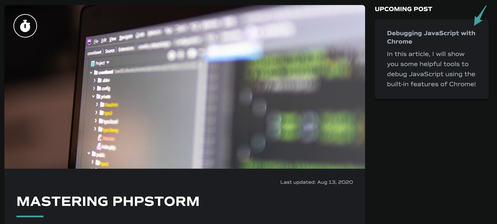
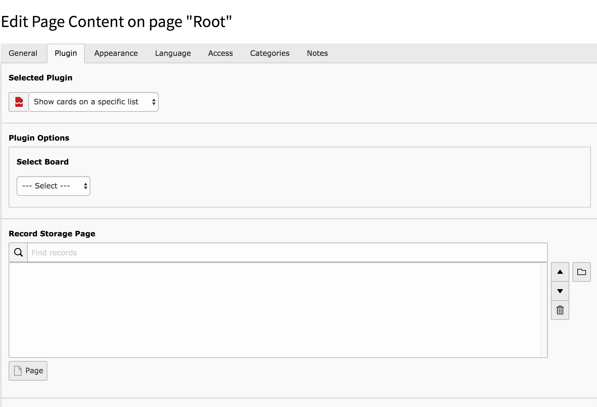

# TYPO3 Trello Integration
Use the Trello REST API to display Trello Boards on your TYPO3 Site.

## Current features
- Show cards of given list on a board

## Configuration
To use this Extension, you first have to configure your Trello API Key and Token.
This can be done visiting https://trello.com/app-key

After retrieving your key and token you can set them globally by using the Extension Configuration.

## Examples
Display a list of upcoming posts on your blog!

## Features

### Display a list
With the "Show cards on list"-Plugin it's possible to display cards of specified list.
